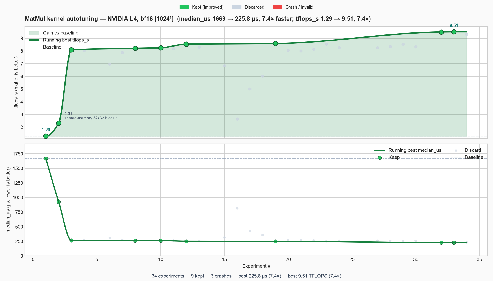

# autokernel

**Autoresearch for GPU kernels** — one editable CUDA file, fixed MatMul benchmark, git keep/revert loop.

For the **general self-improving pattern** (how to adapt this to other domains), see the [parent README](../README.md).

Inspired by [Karpathy's autoresearch](https://github.com/karpathy/autoresearch).

## Results (autonomous agent on NVIDIA L4)

A Cursor agent edited **`kernel.cu` only** on branch `autokernel/jun21` — fixed harness, git keep/revert loop, **34 experiments** (9 kept, 3 crashes). The chart below is generated from [`results.tsv`](results.tsv) via `uv run plot.py`.



| | Baseline (naive) | Best (kept) | Change |
|---|------------------|-------------|--------|
| **`median_us`** | 1,669 µs | **226 µs** | **7.4× faster** |
| **`tflops_s`** | 1.29 | **9.51** | **7.4× higher** |
| **Experiments** | — | 9 kept / 34 total | 3 crashes |

Key kept milestones: shared-memory **32×32** tile (→ 928 µs), **64×64** register blocking (→ 265 µs), **BK=64** bf16 tiles + **fmaf** (→ 250 µs), then **cp.async** aligned loads (→ **226 µs**, **9.51 TFLOPS**). Discarded runs were correct but slower; crashes were reverted via `git reset --hard`.

Regenerate the chart after your own run:

```bash
uv run plot.py    # reads results.tsv → progress.png
```

## How it works

```text
prepare.py   — fixed problem, reference, correctness, timing (do not modify)
kernel.cu    — CUDA C++ MatMul kernel (agent modifies this)
kernel.py    — JIT compile/load wrapper (do not modify)
bench.py     — runs benchmark, prints grep-friendly metrics (do not modify)
plot.py      — reads results.tsv, writes progress.png
program.md   — agent instructions ("research org code")
results.tsv  — local experiment log (do not commit)
```

## Problem: MatMul


```text
C = A @ B
A: [1024, 1024]   B: [1024, 1024]   C: [1024, 1024]
```

Baseline kernel: naive loop over K with one thread per output element.

**Goal:** minimize `median_us` (lower is better). Correctness is mandatory (`correct: True`).

## Quick start

**Requirements:** NVIDIA GPU + driver (`nvidia-smi` works), Linux, Python 3.11, [uv](https://docs.astral.sh/uv/).

### 1. CUDA toolkit (cloud GPU / Debian 13)

Driver **535 is too old** for PyTorch cu128. Use driver **560+**, then install nvcc:

```bash
chmod +x install_cuda128.sh
./install_cuda128.sh
```

Or manually:

```bash
export CUDA_HOME=/usr/local/cuda-12.8
export PATH=$CUDA_HOME/bin:$PATH
export LD_LIBRARY_PATH=$CUDA_HOME/lib64/stubs:$CUDA_HOME/lib64:${LD_LIBRARY_PATH:-}
```

Add those lines to `~/.bashrc`. The **`stubs`** path is required for the link step (`-lcuda`).

Do **not** use `apt install cuda-nvcc-13-*` — runtime mismatch with PyTorch cu128 wheels.

### 2. Run benchmark

```bash
uv sync
rm -rf ~/.cache/torch_extensions/*/autokernel_matmul   # after env changes
uv run check_cuda.py
uv run bench.py
```

Expected output:

```text
Device: NVIDIA L4
Capability: (8, 9)
---
label:            kernel
correct:          True
median_us:        1467.141
p95_us:           1813.947
gbytes_s:         4.29
tflops_s:         1.46
max_abs_err:      0.500000
max_rel_err:      0.009756
bench_seconds:    0.08
total_seconds:    51.22
problem:          MatMul [1024,1024] x [1024,1024] torch.bfloat16
iters:            50 timed (cap 60s)
```

First run JIT-compiles `kernel.cu` (~30–60s). Later runs are faster unless `kernel.cu` changes.

## Git + experiment branch

```bash
git checkout -b autokernel/<tag>    # e.g. autokernel/jun21
printf 'commit\tmedian_us\ttflops_s\tstatus\tdescription\n' > results.tsv
git add kernel.cu
git commit -m "baseline: naive matmul"
```

Experiment commits on this branch should contain **`kernel.cu` only**. Harness changes go on `main`.

## Run the agent

Connect [Cursor Remote SSH](../README.md#running-with-cursor-or-any-agent) to your GPU machine, enable **auto-run**, then:

```text
Setup is COMPLETE. Read program.md and run the experiment loop on branch autokernel/<tag>.
Only edit kernel.cu. Do not ask me questions — keep iterating until I stop you.
```

## Progress chart

Generated from `results.tsv` (continuous running-best curves + per-experiment scatter):

```bash
uv run plot.py    # → progress.png
```

- **Top:** `tflops_s` — smooth running-best curve + scatter per experiment.
- **Bottom:** `median_us` (µs) — smooth running-best curve + baseline dashed line.

Invalid runs (`999999` µs / crashes) are excluded from latency scatter so the scale stays readable.

## Apply this pattern elsewhere

The loop is the same; only the **candidate file** and **metric** change. Swap `kernel.cu` / `median_us` for your domain:

| You want to improve… | Agent edits | `prepare.py` checks | Keep if… |
|---------------------|-------------|---------------------|----------|
| LLM training code | `train.py` | loss on fixed val set | `val_bpb` ↓ ([autoresearch](../autoresearch/)) |
| A hot JSON parser | `parse.py` | output == reference on 10k fixtures | `median_us` ↓ per batch |
| A ranking function | `score.py` | NDCG on fixed queries | `ndcg` ↑ |

**Mini recipe:** copy this repo’s layout → rename the editable file → implement reference + timing in `prepare.py` → write `program.md` with the keep/revert loop → run the agent on branch `auto-<name>/<tag>`. Full blueprint: [parent README](../README.md).

## License

MIT
